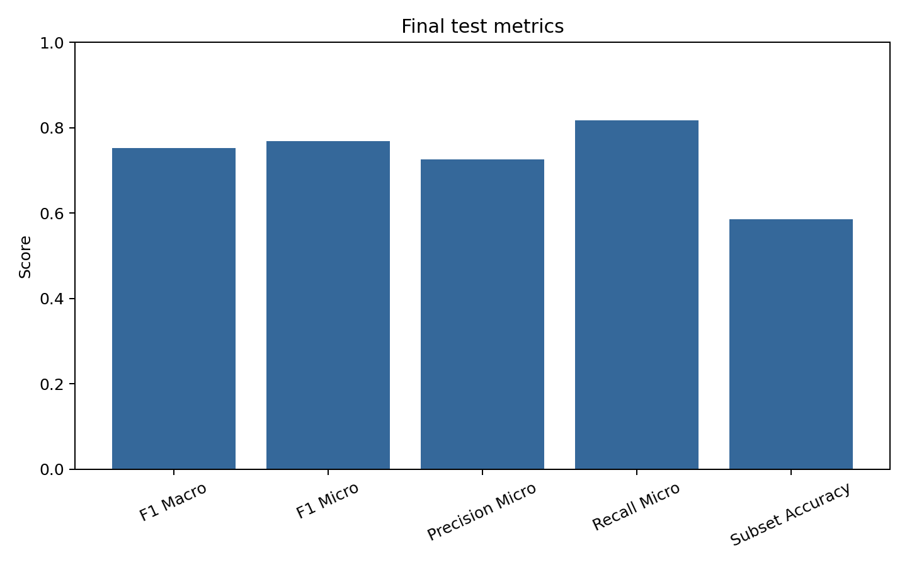
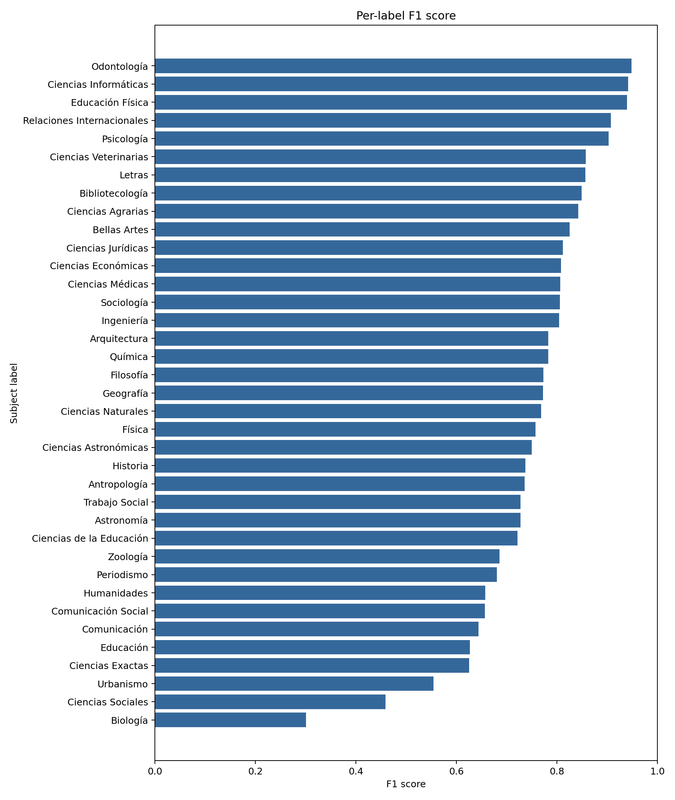
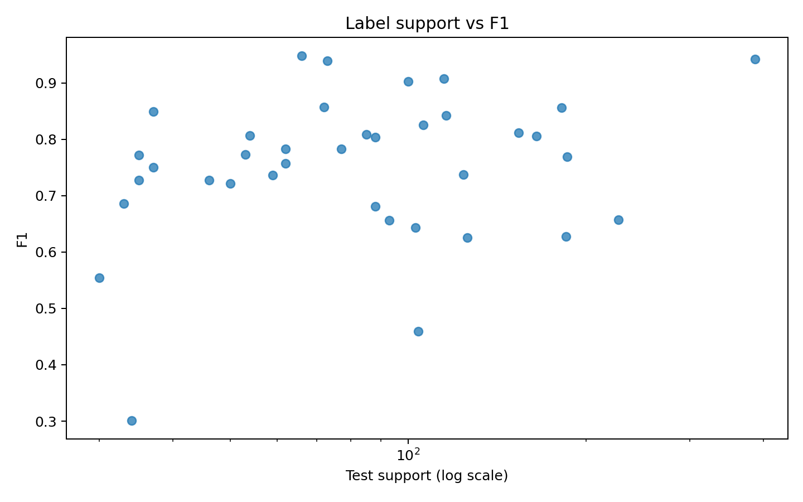
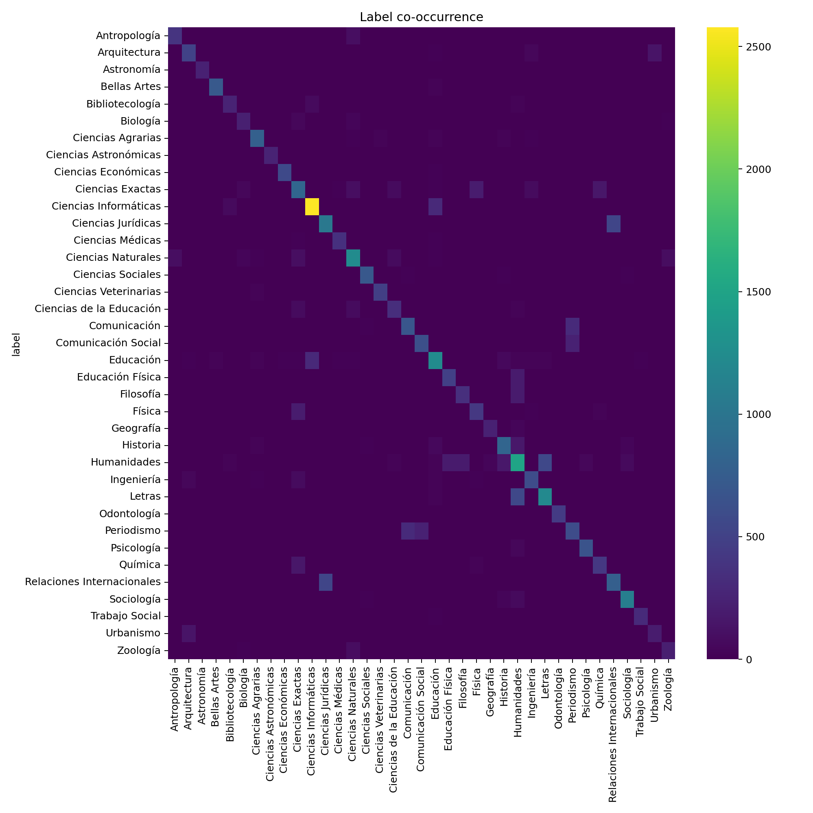
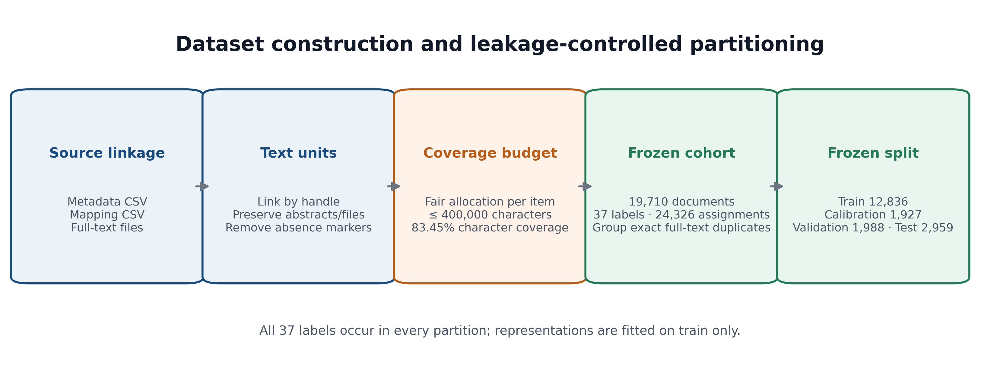
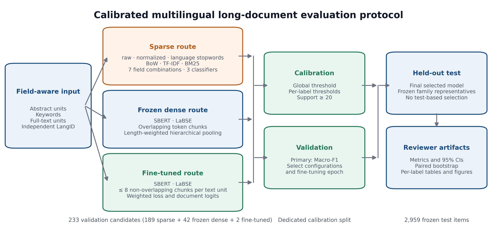

# Paper evaluation artifacts

This directory is the public, reviewer-facing evidence package for the 2026
20k-document experiment. It contains only aggregate results and figures; no
repository text, handles, item-level predictions, split manifests, credentials,
or model checkpoints are included.

## Experimental evidence

- Main run: `20260802T165746Z_full_20k_v3_segmented_finetuned_2026`
- Convergence audit: `20260804T102544Z_convergence_audit_20k_2026`
- Main-run commit: `7181fcceb7a62a155e589b53015a9de7a31dc083`
- Audit implementation commit: `6e46e5c2af0249591d1f59b07b82ad43125bd0a2`
- Cohort: 19,710 documents, 37 labels, 24,326 assignments
- Frozen split: 12,836 train, 1,927 calibration, 1,988 validation, 2,959 test

Start with [`SUPPLEMENTARY_MATERIAL.md`](SUPPLEMENTARY_MATERIAL.md) for the
reviewer-oriented narrative, [`RUNS_AND_PROVENANCE.md`](RUNS_AND_PROVENANCE.md)
for the two-run audit trail, and the run-specific aggregate directories for the
underlying evidence.

`CACIC_2026_Supplementary_Material.docx` and
`CACIC_2026_Supplementary_Material.pdf` are reviewer-ready renderings of the
same evidence, generated reproducibly by `scripts/build_supplementary_docx.py`
and `scripts/build_supplementary_pdf.py`. The PDF includes the principal
tables, all 37 per-subject results, and the main diagnostic figures; the full
233-row grid remains available as a machine-readable CSV.
`MANIFEST.sha256` provides a checksum for every file in this reviewer package.

The focused audit retained BM25 over language-aware stopword-filtered full text
with Linear SVC (`C=0.5`, stored `tol=0.0005`). Tolerances `0.0001` and
`0.0005` tied on the recorded validation metrics; no superiority is claimed.
All 37 one-vs-rest fits converged in the final validation and test refits.

## Files

### Tables

- `tables/final_test_metrics.csv`: definitive held-out result.
- `tables/family_test_comparison.csv`: frozen representative of each model
  family from the original v3 run.
- `tables/validation_leaders.csv`: primary and secondary validation leaders,
  including the combined-field Micro-F1 leader.
- `tables/per_label_test.csv`: per-subject test metrics for the final model.
- `tables/language_agreement_summary.csv`: declared-versus-detected language
  agreement; this is not an accuracy estimate.
- `tables/transformer_validation.csv` and `tables/*_epoch_history.csv`:
  fine-tuning selection and learning curves.
- `tables/paired_bootstrap_updated.csv`: exact item-level paired-bootstrap
  differences recomputed with 1,000 draws and seed 42.
- `tables/classifier_convergence.csv`: per-label convergence audit.
- `runs/v3_main/`: aggregate corpus, language, coverage, label, complete
  233-candidate validation and operational timing artifacts from the main run.
- `runs/convergence_audit/`: aggregate eight-fit audit, final metrics,
  confidence intervals, thresholds, errors and operational timing artifacts.

### Figures

The PNG files under `figures/` were produced by the reporting stage and are
publication-ready examples. Original subject names are intentionally retained;
all other labels and captions are in English.

| Test metrics | Per-subject F1 |
|---|---|
|  |  |

| Support vs. F1 | Label co-occurrence |
|---|---|
|  |  |

The corrected manuscript workflow figures are:

| Dataset construction | Experimental protocol |
|---|---|
|  |  |

## Interpretation

Macro-F1 was the prespecified primary selection metric. The final full-text
BM25 model led validation Macro-F1 and achieved test Macro-F1 `0.752228` and
Micro-F1 `0.768458`. A different configuration—BM25 over abstract, keywords,
and full text with logistic regression—led validation Micro-F1 (`0.777362`)
but not Macro-F1 (`0.738822`), so it was not promoted to the final test.

Results in this directory are evidence, not a miniature dataset. To exercise
the software, run the synthetic Colab default or `configs/dummy.yaml`.
